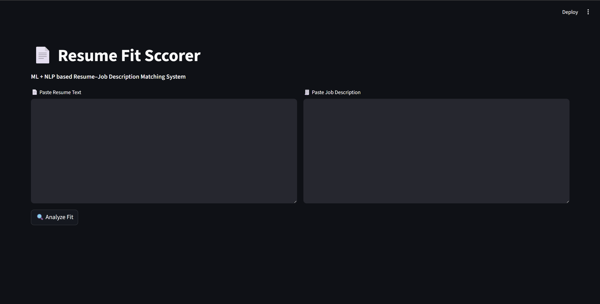

# 📄 Resume Fit Scorer – ML + NLP Project

An end-to-end Machine Learning application that evaluates **how well a resume matches a job description**.  
The system combines **NLP-based text similarity** with **skill gap analysis** to generate an explainable and realistic resume match score.

This project demonstrates **classical ML fundamentals**, not deep learning, making it lightweight, interpretable, and recruiter-friendly.

---

## 🚀 Why This Project?

Recruiters manually scan hundreds of resumes every day.  
Small differences in skill alignment or wording can significantly impact shortlisting decisions.

👉 This project answers:
- How well does a resume match a given job description?
- Which skills are missing?
- How much of the match is due to skills vs overall context?

---

## 🧠 How It Works (Simple Explanation)

The system uses **two independent scoring mechanisms**:

### 1️⃣ Skill Match Score (Most Important)
- Extracts predefined technical skills from both resume and job description
- Computes how many required skills are present in the resume
- Produces a **Skill Match Percentage**

> Example:  
> Job requires 10 skills, resume has 8 → Skill Match = 80%

---

### 2️⃣ Text Similarity Score
- Uses **TF-IDF + Cosine Similarity**
- Measures how similar the *overall wording and context* of the resume is to the job description
- Uses **n-grams** to correctly capture phrases like *“machine learning”*

---

### 🎯 Final Resume Match Score
The final score is a **weighted combination**:
Final Score = (60% Skill Match) + (40% Text Similarity)

---

## This ensures:
- Skills drive the decision
- Context and experience still matter
- Scores remain realistic and explainable

---

## 🛠 Tech Stack

- **Python**
- **Scikit-learn** (TF-IDF, cosine similarity)
- **NLP (light preprocessing)**
- **Streamlit** (interactive UI)
- **Matplotlib** (visual analysis)

> No deep learning, no APIs, no black-box models.

---

## ✨ Features

- 📊 Resume–JD Match Score (%)
- ✅ Matched Skills Identification
- ❌ Missing Skills Detection
- 📈 Skill Gap Visualization
- 🖥 Interactive Streamlit Interface
- 🧠 Explainable ML logic

---

## 📁 Project Structure

```bash
resume-fit-scorer/
│
├── app.py # Streamlit application
├── requirements.txt # Dependencies
├── README.md # Project documentation
│
├── nlp/
│ ├── text_cleaner.py # Text preprocessing
│ └── skill_extractor.py # Skill extraction logic
│
├── ml/
│ ├── similarity.py # TF-IDF + cosine similarity
│ └── scoring.py # Skill-aware scoring logic
│
└── assets/
└── skill_plot.py # Visualization
```
---

## ▶️ How to Run Locally

### 1️⃣ Install dependencies
```bash
pip install -r requirements.txt
```

### 2️⃣ Run the app
```bash
streamlit run app.py
```

### 3️⃣ Paste:
Resume text
Job description text
and click Analyze Fit

---
## 📊 Sample Output
```bash
Resume Match Score: 79.2%

Skill Match: 100%
Text Similarity: 48%

Matched Skills:
python, machine learning, nlp, pandas, numpy, sql, aws

Missing Skills:
None
```
---

### 🧠 Key Learnings

Over-aggressive NLP preprocessing can harm similarity scoring

Skill-based matching must be separated from document similarity

Combining multiple ML signals leads to more realistic results

Explainability is as important as accuracy in real-world ML systems

---

### 🚀 Possible Enhancements

PDF resume upload

Core vs optional skill weighting

Experience-based scoring

BM25 similarity instead of TF-IDF

Resume improvement suggestions

---
## 🖥 Application Interface

<p align="center">
  
</p>
---

### 👨‍💻 Author

Ayush Soni
Machine Learning Enthusiast | Python | NLP | Classical ML

⭐ If you found this project useful, feel free to star the repository!
